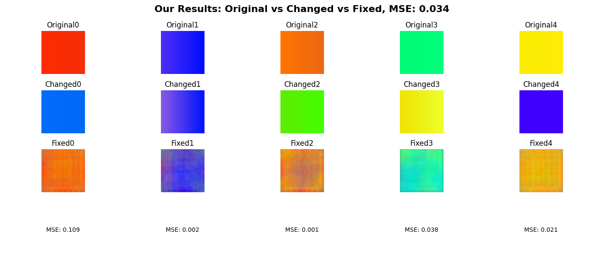

# gws-positioning

## Dataset Discription
- 3* 30* 30 size CSI
- RP 24
- 30 times per RP
Therefore, scenex_cir.npy's size is (24* 30)* 3* 30* 30, in numpy [720, 3, 30, 30].

## Indoor Channel Generator
options:
- -h, --help     show this help message and exit
- --seed SEED    Random seed value (default: 43)
- --scene SCENE  Scene number (default: 0)

## Experimental Results

### Data Augmentation Results Analysis

The following shows the experimental results with applied data augmentation techniques:

The above figure demonstrates performance changes when various data augmentation techniques are applied.

Key observations:
- 30% Lower MSE then reference results, High-recoveration
- Spatial vector has objects' axes and rotation information more diterministic

### Comparison with Reference Results

### Conclusion

